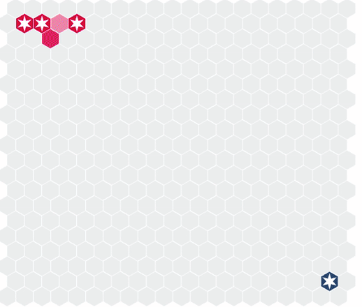

# Introduction

Welcome to Monad, the web's premiere AI programming challenge! Our goal is to provide users
with an engaging environment in which to hone their programming skills while simultaneously
introducing them to the basics of implementing artificial intelligence agents.

### Overview

In Monad, users compete in an original turn-based strategy game wherein the aim is to
eliminate all other players through a combination of strategic and tactical decision making.
Unlike most games of its kind, however, it's not users themselves who sit at the controls
and make these decisions, but rather artificial intelligence agents (hereafter referred to as "bots")
that they implement via a computer program.

### Getting Started

To get started playing Monad, head over to the [getting started](../getting-started/) page
for instructions on getting your development environment set up and writing the code
to implement your first bot.

From there, the sky is the limit.
Upload your bot to the Monad servers and observe how it stacks up. Challenge your
friends to matches to see who has found the stronger strategy.
Watch how your skill rating, which
gets updated after every match your bot completes, fluctuates over time. Use all of this information to
iterate on your current design and improve your bot's strategies.

